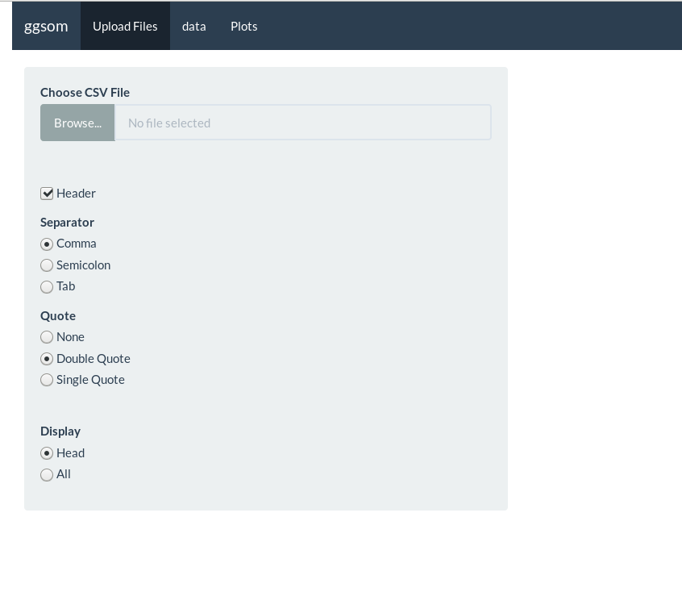
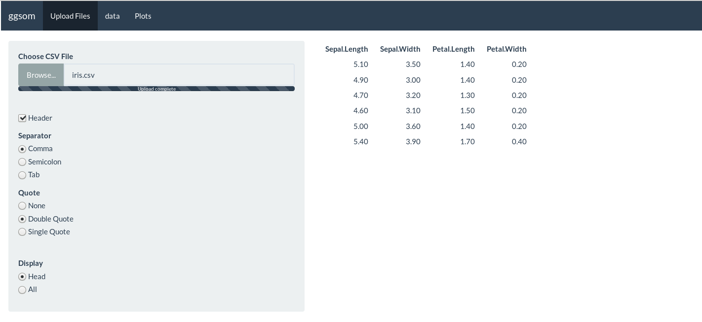
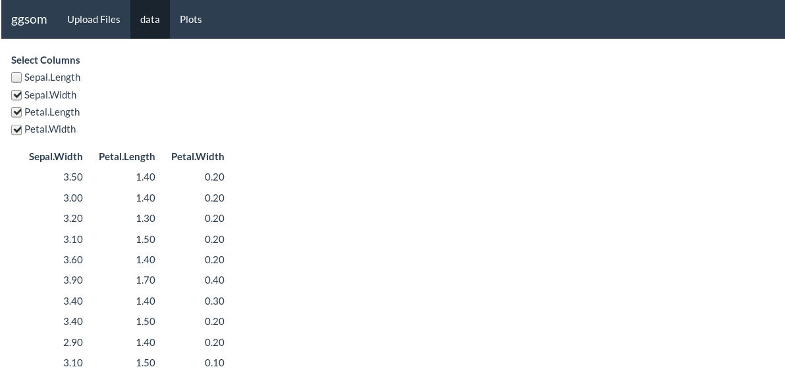

## Shiny application for ggsom package :bar_chart: :bar_chart:

---

## You can try it out!
[ggsomshiny](https://oldlipe.shinyapps.io/ggsomshiny/)

---

## Quick tutorial

---

### Upload your dataset 

### Choose the columns that you want to use on plot

### Visualisations methods
![] (https://media.giphy.com/media/8mhkIe0oXGdYdmeTam/giphy.gif)

## TODO
- [ ] Remove error code when has no columns selected :hammer:
- [ ] Add new tab for build som object :hammer:

## Acknowledgments
- Rafael Santos
