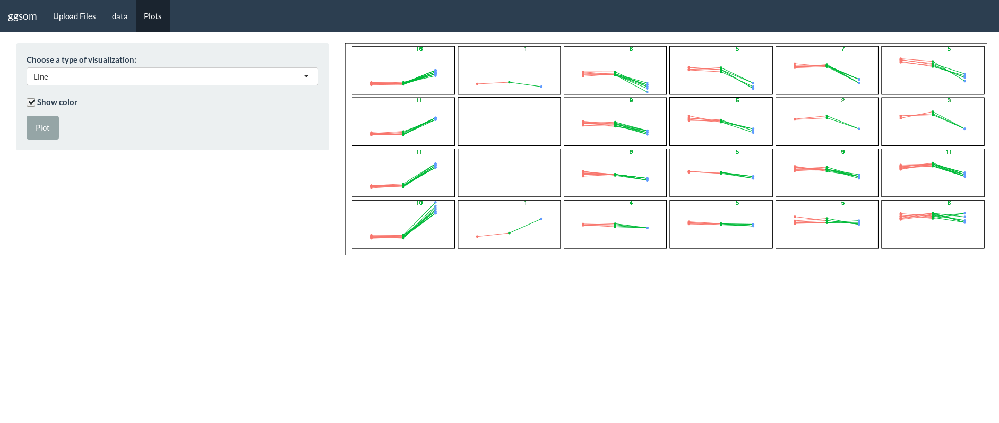
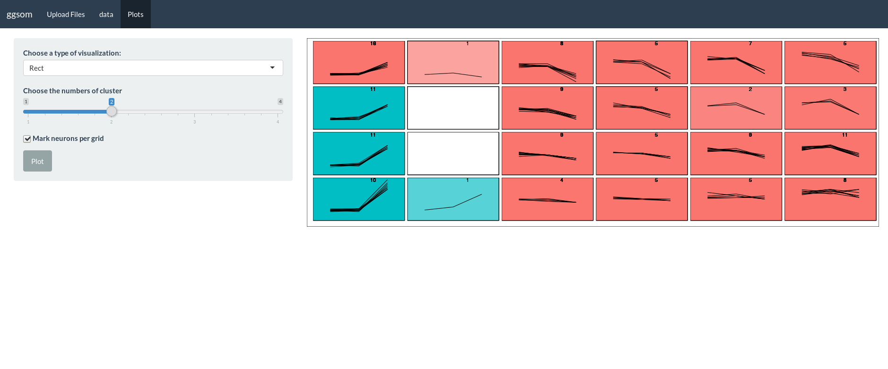

## Shiny application for ggsom package :bar_chart: :bar_chart:

## You can try it out!
[ggsomshiny](https://oldlipe.shinyapps.io/ggsomshiny/)

## Quick tutorial

### Upload your dataset 

### Choose the columns that you want to use on plot

### Line plot

### Rect plot

## TODO
- [ ] Remove error code when has no columns selected :hammer:

## Acknowledgments
- Rafael Santos